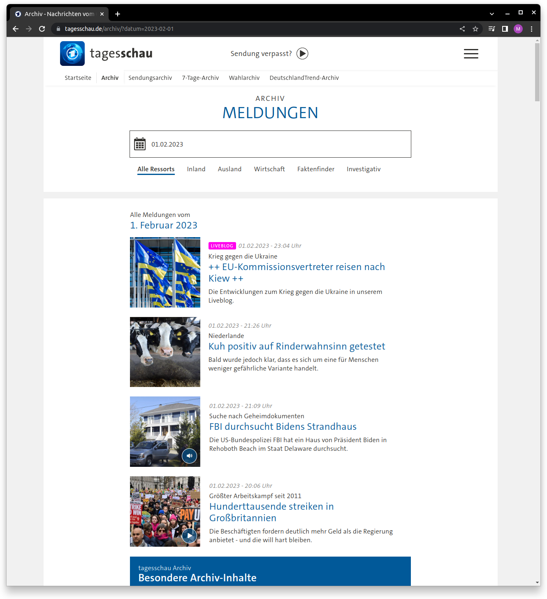

# Scraping the german news archive
## Introduction
Automatic information retrieval is a topic I am interested now in for quite a long time. This is the reason why I started a personal project in this field. My goal was on the automation of insights generation from news articles. Since I am living in Germany, it is therefore quite natural to start this project with a popular German news portal, Tagesschau.de.

Interesting in Tagesschau.de is that you have access to a news archive, where you can browse articles based on date and news category. The page structure is very simple and well-structured. There are preview information given for all articles corresponding to a date and category. The structure is as follows:
* Publishing date
* Teaser topline
* Teaser headline
* Teaser shorttext

Teaser headline is clickable and leads directly to the corresponding article behind the teaser. In the news article you can find obviously the content of the article, usually in text format. Sometimes the article content is enriched by other media formats like audio or video streams. What I find very useful with regard to information retrieval is that each article is tagged by different topics. In the following we want to extract this tag list.

Tagesschau.de does not only tag their articles, they also make it easier for the end-user to search for specific tags such that you can get filtered list of articles corresponding to a specific topic. In addition, they also provide some basic analytics in terms of top topics by tags or top ten of most clicked articles.

## Retrieving data for a purpose
The purpose for scraping the news archive is to generate insights that were not directly accessible through website. I am personally interested in the occurrence of tags over time and how topics are influenced by each other. The topic of *media coverage* is something that can not be investigated by only looking at one news portal, however, I hope that we can see somehow the rise and fall of different topics.

## Solution architecture for insights from news articles
The vision of this project is beyond writing scripts that scrape the news portal. One the hand, extracting news article information is central for this project but only a technical building block to gather information from which higher level data products can be built. According to this, the solution architecture can be organized into three building blocks.
1. Scraper library customized to tagesschau.de
2. Execution: Embedding the scraper into serverless functions architecture
3. Analytics: Analyzing the scraped data for building higher-level data products
4. Consumption: Insights visualization through a dashboard



## Purpose of the blog post
In this blog post the focus is on explaining how to build a scraper for tagesschau.de with python. The advantage of the approach showed here is the modular structure of the scraper. Open to extension close to modification.

## Unstanding the structure of tagesschau.de
* Archive
* Teaser
* Article

What can be scraped, what will be scraped?

**GIVE EXAMPLES WITH HTML**

## Setting up the environment
The tagesschauscraper can be cloned from the github repository https://github.com/TheFerry10/TagesschauScraper.git. A dockerfile is added to the repository to make it convenient to work with the code. Makefile is also added for quick access of recurring tasks like testing, linting, etc.
Beautifulsoup and requests are used heavily in this project for writing the functions to scrape the content.

## Scraping the tagesschau.de news portal
The core functionality is the ability to scrape news teaser from a provided url. The class ``TagesschauScraper`` abstracts the scraping process and hides implementation details from the client. Note that this class can be later easily extended by a ``scrape_article`` method if desired.

```python
class TagesschauScraper:
    """
    A web scraper specified for scraping the news archive of Tagesschau.de.
    """

    def __init__(self) -> None:
        self.validation_element = {"class": "archive__headline"}

    def scrape_teaser(self, url: str) -> dict:
        """
        Scrape all teaser on the archive <url>.

        Parameters
        ----------
        url : str
            Archive website.

        Returns
        -------
        dict
            Scraped teaser.
        """
        websiteTest = retrieve.WebsiteTest(url)
        if websiteTest.is_element(self.validation_element):
            return self._extract_info_for_all_teaser(websiteTest.soup)
        else:
            raise ValueError(
                f"HTML element with specifications {self.validation_element}  "
                f"cannot be found in URL {url}"
            )
```

The ``scrape_teaser`` method requires one argument, the url to the archive to scrape teaser from. The archive url is assembeled from the base url of the archive and a query string, e.g. https://www.tagesschau.de/archiv/?datum=2023-02-01&ressort=inland. The query string takes two parameters, a date (datum) and the news category (ressort). When a news category is not specified, the filtering on the news category is omitted.
For convenience, a function taking care of the generation of a valid archive url is given by
```python
def create_url_for_news_archive(
    date_: date,
    category: Literal["wirtschaft", "inland", "ausland", "all"] = "all",
) -> str:
    """
    Creating a url leading to the articles published on the specified date.
    Additionally, the articles can be filtered by the category.

    Parameters
    ----------
    date_ : date
        Filter articles on date.
    category : str, optional
        Filter articles on category. Could be "wirtschaft", "inland",
        "ausland" or "all".
        By default, "all" is selected.

    Returns
    -------
    str
        Url for the news archive.

    Raises
    ------
    ValueError
        When category is not defined.
    """
    categories = ["wirtschaft", "inland", "ausland"]
    date_pattern = "%Y-%m-%d"
    date_str = date_.strftime(date_pattern)
    if category in categories:
        return f"https://www.tagesschau.de/archiv/?datum={date_str}&ressort={category}"
    elif category == "all":
        return f"https://www.tagesschau.de/archiv/?datum={date_str}"
    else:
        raise ValueError(
            f"category {category} not defined. category must be in "
            f"{categories}"
        )
```

Finally we can scrape all teaser in the economy (German: Wirtschaft) category, which are published on the 1st Feb 2023 by executing:

```python
from datetime import date
from tagesschauscraper import tagesschau

url = tagesschau.create_url_for_news_archive(date(2023,2,1), "wirtschaft") # returns "https://www.tagesschau.de/archiv/?datum=2023-02-01&ressort=wirtschaft"
tagesschauScraper = tagesschau.TagesschauScraper()
teaser = tagesschauScraper.scrape_teaser(url)
```
All implementation details are abstracted and therefore hidden from the client.

Behind the scenes, we need to fetch the list of teaser from the *Archive*, extracting all *Teaser* and enriching the information from the teaser by the tags mentioned in the *Article*. To garuantee a maintainable and adaptable code, the following classes are defined.
```python
class Archive:
    """
    A class for extracting information from news archive.
    """

class Teaser:
    """
    A class for extracting information from news teaser elements.
    """

class Article:
    """
    A class for extracting information from news article HTML elements.
    """
```
Implementation details are encapsulated inside these functions. Orthogonality is preserved since each of these functions are treating an isolated aspect.

## Lessons learned
For me personally, this project is not exclusively about how to build a scraper with python. When I started this project, I was also started learning more about best practices in clean code with python. This work is therefore strongly influenced by the book *Clean Code in Python* from Mariano Anaya. Going in to the details of this book is probably a topic on its own. However, I would like to state that Mariano's book gave me guidance on how to test, refactor and basically write maintainable code in python. By no means I would say that I applied every concept here and I know that I have to learn so many things. It is a completely different game when you not only reading about best practices and try to follow code snippets but want to apply them.


### Abstraction, orthogonality, separation of concerns, testability
"Good software is testable software" - Mariano Anaya

By writing small cohesive functions we can come up with a software design which is easy to maintain because it can be easily unit tested. The ability to test our code is the basis for refactoring our code in a reliable and systematic way.

When I was done with the first iteration of my code, I realized that certain parts are complicated to test.
The *Teaser* class has responsibilities that are beyond the scope of operations on teaser. The core functionality of the *Teaser* class is to extract all information from a given teaser. In addition, the functionality to enrich the teaser information with the corresponding article tags couples the *Article* and *Teaser* class in an undiserable way. Through this coupling the impression is created that article tags are part of a teaser which is not the case. It still makes sense that information from a teaser are merged with article information, e.g. article tags, but this merging needs to be happen on a higher abstraction level to garantee cohesive as well as loose coupling between the low-level abstraction layers like *Article*, *Teaser*, *Archive*.

```python
class Teaser:
    """
    A class for extracting information from news teaser elements.
    """

    def __init__(self, soup: BeautifulSoup) -> None:
        """
        Initializes the Teaser with the provided BeautifulSoup element.

        Parameters
        ----------
        soup : BeautifulSoup
            BeautifulSoup object representing an element for a news teaser.
        """


    def extract_info_from_teaser(self) -> dict:
        """
        Extracts structured information from a teaser element.
        The extracted elements are:
        * date
        * topline
        * headline
        * shorttext
        * article link

        Returns
        -------
        dict
            A dictionary containing all the information of the news teaser
        """


    def enrich_teaser_info_with_article_tags(self, teaser_info: dict) -> dict:
        """
        Enrich the teaser information with the article tags.

        Parameters
        ----------
        teaser_info : dict
            All information extracted from the news teaser.

        Returns
        -------
        dict
            Dictionary containing news teaser information enriched by article
            tags.
        """
        article_link = teaser_info["link"]
        try:
            article_soup = retrieve.get_soup_from_url(article_link)

        except requests.exceptions.TooManyRedirects:
            print(f"Article not found for link: {article_link}.")

        else:
            articleObj = Article(article_soup)
            article_tags = articleObj.extract_article_tags()
            teaser_info.update(article_tags)
            self.teaser_info.update(teaser_info)

        return teaser_info
```

Old way of doing things:
```python
class TagesschauScraper:
    """
    A web scraper specified for scraping the news archive of Tagesschau.de.
    """

    def __init__(self) -> None:
        self.validation_element = {"class": "archive__headline"}

    def scrape_teaser(self, url: str) -> dict:
        """
        Scrape all teaser on the archive <url>.

        Parameters
        ----------
        url : str
            Archive website.

        Returns
        -------
        dict
            Scraped teaser.
        """
        websiteTest = retrieve.WebsiteTest(url)
        if websiteTest.is_element(self.validation_element):
            return self._extract_info_for_all_teaser(websiteTest.soup)
        else:
            raise ValueError(
                f"HTML element with specifications {self.validation_element}  "
                f"cannot be found in URL {url}"
            )

    def _extract_info_for_all_teaser(self, soup: BeautifulSoup) -> dict:
        self.teaser_element = {
            "class": "columns teaser-xs twelve teaser-xs__wide"
        }
        extracted_teaser_list = []
        for teaser in soup.find_all(
            class_="columns teaser-xs twelve teaser-xs__wide"
        ):
            teaserObj = Teaser(soup=teaser)
            teaser_info = teaserObj.extract_info_from_teaser()
            teaser_info_enriched = (
                teaserObj.enrich_teaser_info_with_article_tags(teaser_info)
            )
            teaser_info_processed = teaserObj.process_info(
                teaser_info_enriched
            )
            if teaserObj.is_teaser_info_valid(teaser_info_processed):
                extracted_teaser_list.append(teaserObj.teaser_info)
        return {"teaser": extracted_teaser_list}
```

## Scope
What is the core functionality of the scraper?
The core functionality of the tagesschau scraper is to scrape the available data
related to a news article.
The news articles are organized through a list of teaser, giving the reader an
overview of the content of the news article. By clicking on a headline, the reader
is redirected to the full article. Here, article tags are mentioned which helps
categorizing the article's content.

The desired behavior of the scraper would be to provide a url to the scraper
